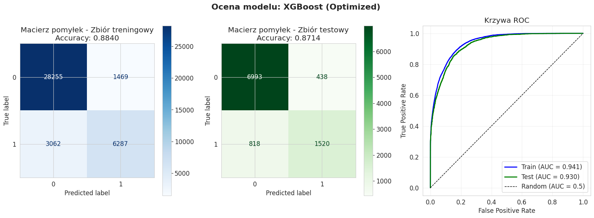
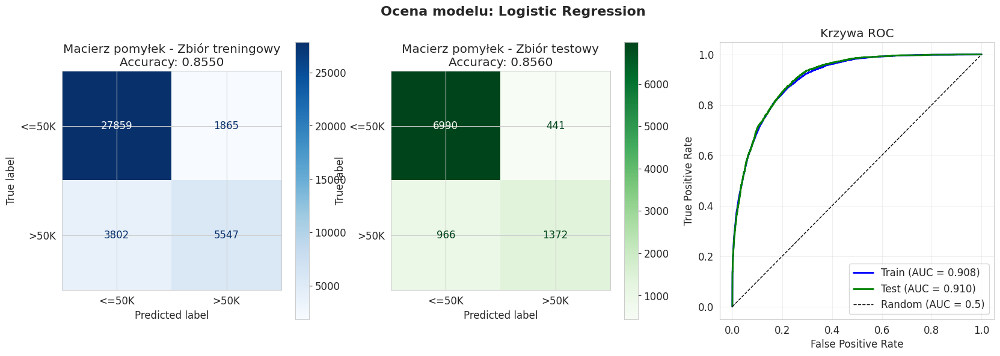
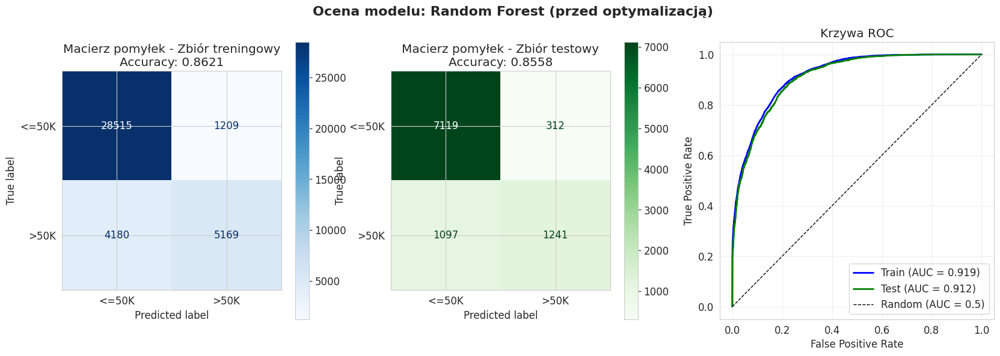

# Income Classification

Binary classification predicting whether a person's annual income exceeds $50 000,
based on demographic and employment data from the 1994 US Census.

*Best model: XGBoost - test accuracy 87%, ROC AUC 0.93*

---

## Authors

2-person team project - SGGW, course: Python w analizie danych i uczeniu maszynowym (2025/2026).

| Name | GitHub |
|------|--------|
| Jakub Rosa | [PogchampMuffin3](https://github.com/PogchampMuffin3) |
| Jakub Dąbrowski | [jakubdabrowskii](https://github.com/jakubdabrowskii) |

> The project was developed collaboratively outside of a version control system.  
> The notebook is written in Polish.

---

## Dataset

UCI Adult (Census Income) dataset - fetched automatically via `ucimlrepo` (no manual download required).

| Property | Value |
|----------|-------|
| Records | 48 842 |
| Features | 14 (mix of categorical and continuous) |
| Target | `income`: `<=50K` / `>50K` |
| Missing values | ~7% in `workclass` and `occupation` (imputed) |
| Source | [UCI ML Repository - Adult](https://archive.ics.uci.edu/dataset/2/adult) |

---

## Method

1. **Exploratory data analysis** - distributions, missing values, correlation matrix, class balance
2. **Data cleaning** - `?` values replaced with `NaN`; target column normalised (removed trailing dots)
3. **Feature engineering** - custom `FeatureEngineeringTransformer`:
   - `has_capital` - binary flag indicating any capital gain or loss
   - `relationship` - `Husband` / `Wife` merged into `Married`
4. **Pipeline** - Scikit-learn `Pipeline` with separate numerical and categorical branches:
   - Numerical: median imputation → `StandardScaler`
   - Categorical: most-frequent imputation → `OneHotEncoder`
5. **Models trained and compared** - Logistic Regression, Random Forest, XGBoost
6. **Hyperparameter tuning** - `RandomizedSearchCV` with cross-validation

---

## Results

| Model | Train Accuracy | Test Accuracy | Test ROC AUC |
|-------|---------------|---------------|-------------|
| Logistic Regression | ~84% | ~85% | ~0.91 |
| Random Forest | ~88% | ~86% | ~0.92 |
| **XGBoost (tuned)** | **~88%** | **~87%** | **~0.93** |

XGBoost achieved the best generalisation with minimal overfitting (train–test accuracy gap < 1%).

---

## Key Findings

### Best model
XGBoost (after tuning) achieved the best overall performance:
- **ROC AUC ~0.93** - excellent ability to rank and separate high-income individuals from the rest
- **Accuracy ~87%** - highest among all tested models

### Algorithm comparison

| Model | ROC AUC | Notes |
|-------|---------|-------|
| Logistic Regression | ~0.91 | Solid baseline; fastest and most interpretable; struggles with non-linear relationships |
| Random Forest | ~0.92 | `class_weight='balanced'` boosted Recall to ~83%, but at the cost of low Precision (~62%) - high false positive rate |
| **XGBoost** | **~0.93** | Best Precision/Recall balance (F1 ~0.71); tuning confirmed model stability with minimal test-set gain |

### Feature importance
Key predictors of income >$50K (tree-based model analysis):

1. **Marital status** - married individuals (`Married-civ-spouse`) earn more at significantly higher rates
2. **Capital gain** - high investment returns are a near-certain indicator of high income
3. **Education level** (`education-num`) - strong positive correlation with earnings
4. **Age** - income peaks in mid-career before declining toward retirement

---

## Visualisations

### Logistic Regression

### Random Forest

### XGBoost (best model)

*Each panel shows confusion matrices (training and test sets) and the ROC curve with AUC scores.*
